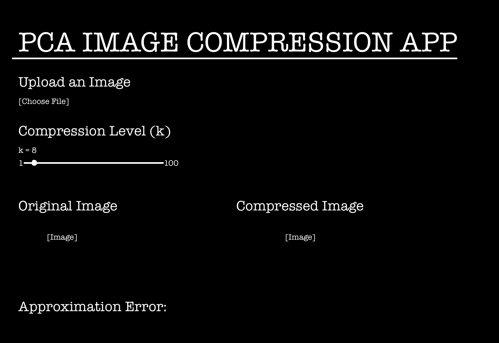

```{r setup, include=FALSE}
knitr::opts_chunk$set(echo = TRUE)
```

## App Design
I would design a PCA compression app that allows the user to complete every step in a simple and organized way. I would place a "file upload" button at the top of the page so the user can choose an image to analyze. Below the upload button, I would include a slider that allows the user to choose the compression level (k). I believe that a slider would make it easier for the user to increase/decrease k and immediately see how the amount of compression affects their image. I would display the current value of k next to the slider so the user is always aware of which compression is being used. The main portion of the app would display the original and compressed image next to each other. I would want both images to be the same size so the difference in quality can be compared fairly. Each image will be labeled so there is no confusion about which one is which. Below the images would be the approximation error for the selected k value. The error will give the user a way to quantitatively evaluate the quality of the approximation. If the user chooses to adjust the slider, both the compressed image and approximation error would update automatically. The overall app design will remain simple so there are no unnecessary buttons. I feel as though this layout will be easy to interact with even for someone who is unfamiliar with PCA or image compression. 

## Mockup of PCA Image Compression App
